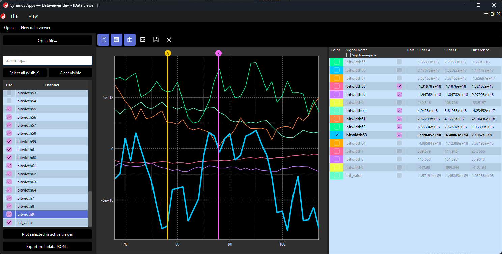

# Synarius Apps


**synarius-apps bundles focused Synarius desktop tools**—plus reusable Qt widgets—so you can **plot measurement channels** and **compare calibration parameters** without opening the full Studio IDE.

It depends on **[synarius-core](https://github.com/synarius-project/synarius-core)** for the shared data model and measurement I/O.

| | |
|--|--|
| **Repository** | [synarius-project/synarius-apps](https://github.com/synarius-project/synarius-apps) |
| **PyPI-style name** | `synarius-apps` (see `pyproject.toml`) |

**Contributing:** follow the **[Synarius programming guidelines](https://synarius-project.github.io/synarius-guidelines/programming_guidelines.html)** (HTML) and this repository’s **[CONTRIBUTING.md](CONTRIBUTING.md)**.

**Note (Windows checkout):** If a junction `synarius-apps` still points at a folder named `synarius-dataviewer`, that layout is fine. To rename the directory in place: close tools using it, remove only the junction (`rmdir synarius-apps`), then rename the real folder to `synarius-apps`.

## What is this?

**Synarius Apps** is the “sidecar” layer of Synarius: **PySide6 applications** and **shared UI code** (`synariustools`) that teams use next to Studio or on their own.

## Included tools

### Synarius DataViewer



**What it does:** explore **multi-channel time-series** with an **oscilloscope-style** plot (zoom, pan, rubber-band zoom, optional rolling window), a **legend** with per-channel visibility and live values, optional **A/B cursors**, and **drag-and-drop** (or programmatic) channel loading.

**When to use it:** you have a log or measurement file and need to **see signals quickly**. The same plot stack is used when **Synarius Studio** opens a live viewer for a diagram **DataViewer** block.

**Run:** `synarius-dataviewer`  
**Implementation:** `src/synarius_dataviewer/` and `src/synariustools/tools/plotwidget/`.

### Synarius ParaWiz


**What it does:** **compare and edit parameter sets** (for example DCM-based calibration data) in one **table**: one row per calibration name, one column per dataset, with optional **filters** (name search, hide equal / show only differing rows).

- **Visual diff:** cell styling and icons highlight **scalar vs. curve vs. map** parameters and cross-dataset differences.  
- **Deep inspection:** double-click opens editors for **CURVE** (tabular breakpoints + 2D plot) and **MAP** (value matrix, axis labels, **3D surface** preview). Edits follow the same rules as the rest of the Synarius toolchain (repository-backed parameters).  
- **Scratch target:** copy selected parameters into a dedicated **`parawiz_target`** dataset for staging changes without overwriting comparison files.  
- **Console:** optional **CLI / CCP** integration for scripting (`select`, `cp`, dataset registration, …).

**Run:** `synarius-parawiz`  
**Implementation:** `src/synarius_parawiz/`.

## Quickstart

**Python 3.11–3.14** is supported (see `requires-python` in `pyproject.toml`). Use a **virtual environment** and the **same** interpreter for `pip`/`python` and for your IDE.

**PySide6** is a declared dependency; after install, confirm imports with the same `python` you use to run the apps:

```bash
python -c "from PySide6.QtCore import Qt, QTimer; print('PySide6 OK')"
```

**CI / clones** resolve `synarius-core` via the Git URL pinned in `pyproject.toml`. Measurement file I/O is implemented in **synarius-core** (`synarius_core.io`); this package still declares `pandas` / `pyarrow` / `asammdf` / `numpy` so installers resolve one consistent stack.

```bash
python -m pip install -U pip
python -m pip install -e .
```

**Local monorepo** (sibling checkout of `synarius-core`):

```bash
cd ../synarius-core && python -m pip install -e ".[timeseries]"
cd ../synarius-apps && python -m pip install -e .
```

If `pip` reports a conflict between the pinned Git revision of `synarius-core` and your local editable core, install the app with `python -m pip install -e . --no-deps` after `python -m pip install -e "../synarius-core[timeseries]"`, then add missing deps manually.

```bash
synarius-dataviewer
synarius-parawiz
```

## Screenshots

See the **DataViewer** and **ParaWiz** sections above.

## Contributing

These apps are where **measurement UX** and **parameter workflows** get refined.

- **Issues:** https://github.com/synarius-project/synarius-apps/issues  
- **Guidelines:** https://synarius-project.github.io/synarius-guidelines/programming_guidelines.html  
- **This repo:** [CONTRIBUTING.md](CONTRIBUTING.md) · [CLA.md](CLA.md)  

**Boundary:** keep **file I/O and domain rules** aligned with **synarius-core** when possible; keep **Qt screens and app wiring** here.

## Branches and automation

| Branch | Workflows |
|--------|-----------|
| `main` | **CI** — Ruff + pytest |
| `dev`  | **Docs** — Sphinx build, deploy to GitHub Pages (repository settings must enable Pages from “GitHub Actions”) |
| Tag `vX.Y.Z` | **Release** — sdist/wheel artifact job, Windows PyInstaller `.exe`, WiX **MSI**, GitHub Release with the MSI (same layout as `synarius-studio`) |

Create a release (example):

```bash
git tag v0.0.1
git push origin v0.0.1
```

## Layout

- `src/synarius_dataviewer/` — Dataviewer application package (console script `synarius-dataviewer`)  
- `src/synarius_parawiz/` — ParaWiz application package (console script `synarius-parawiz`)  
- `src/synariustools/tools/plotwidget/` — reusable Qt plot widget (`DataViewerWidget`, `create_data_viewer`, …)  
- `docs/` — Sphinx + sphinx-needs + zerovm theme  
- `synarius_dataviewer.spec` — PyInstaller one-file spec for the Windows installer job  
- `DISCLAIMER.txt` — license text shown in the MSI  

### Plot widget (embedded use)

```python
from synariustools.tools.plotwidget import create_data_viewer, PlotViewerMode

# embedded=True: toolbar + widget in a small host (default, same idea as the MDI child)
viewer = create_data_viewer(my_callable_or_data_source, parent=None, embedded=True)

# Static mode with legend hidden at startup:
viewer = create_data_viewer(
    my_callable_or_data_source,
    mode=PlotViewerMode.static(legend_visible_by_default=False),
)
```

Imports from `synarius_dataviewer.widgets.data_viewer` remain valid shims to the same implementation.

## Docs (local)

```bash
pip install -e ".[docs]"
sphinx-build -b html docs docs/_build/html
```
